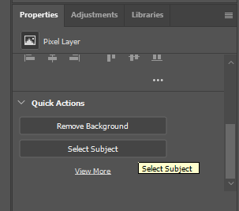
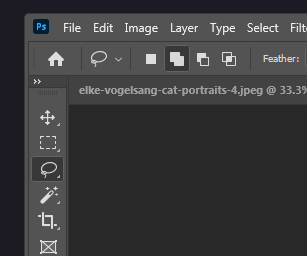
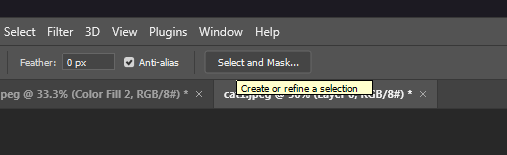
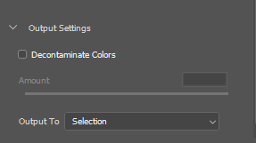

<p align="center"></p>
<h1 align="center"> Photoshop Guide </h1> 
<h4 align="right">Jul 23</h4>


<br>

# Remove Background
 En objetos o sujetos con bordes difusos o no geométricos. Ejemplo:
<p align="center"></p>

1. Abrir imagen y desbloquear para editar
2. Abrir pestaña de Propiedades y seleccionar el sujeto o elemento. ```Window/Properties/Quick Actions/Select Subject```
<p align="center"></p>

3. Usar una herramienta de selección con la opción de "add to selection" seleccionamos cualquier elemento que no haya sido seleccionado con la primera selección del sujeto.
   
<p align="center"></p>

4. presionar el botón de ```Select and Mark...``` <kbd>Alt</kbd> + <kbd>Ctrl</kbd> + <kbd>R</kbd> tomamos el pincel ```Refine Edge Brush Tool``` o Pisando letra <kbd>R</kbd> e ir quitando parte del fondo que quedo en la última selección.
<p align="center"></p>

5. luego en la pestaña ```propiedades/Output Settings``` marcar la opción ```Decontaminate Colors```
<p align="center"></p>

6. Presionar <kbd>Ok</kbd>

Se creará una capa con una máscara de corte que luego podrá editarse para mejorarse con un fondo o dejando la transparencia.

<p align="center"></p>

<br>

<br>

---
Copyright &copy; 2022 [carjavi](https://github.com/carjavi). <br>
```www.instintodigital.net``` <br>
carjavi@hotmail.com <br>
<p align="center">
    <a href="https://instintodigital.net/" target="_blank"></a>
</p>


